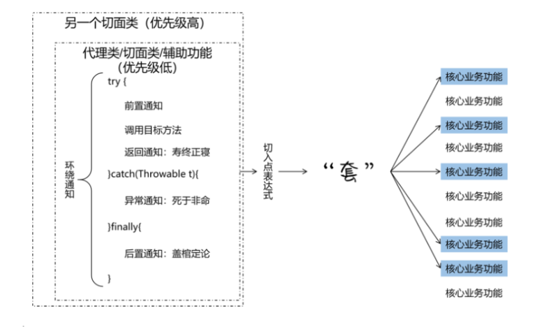
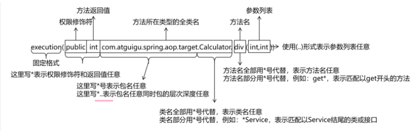
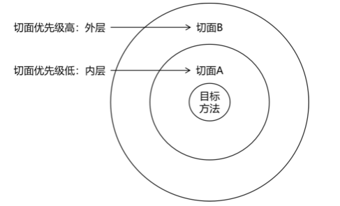

# 简介
这是我学习Spring框架的repo, 参考资料为尚硅谷在B站提供的[课程](https://www.bilibili.com/video/BV1AP411s7D7/) 及
配套的[文档学习资料](https://www.wolai.com/oacbJpH1wPzGNoMAVnoELR).

Spring框架的[官方文档链接](https://spring.io/projects/spring-framework#learn).
<br>
<br>

# 学习思路
**先看尚硅谷提供的文档, 再看尚硅谷的视频**. 
注意尚硅谷提供的文档不足以纯自学,  因此需要看尚硅谷的配套视频, 并且该视频中讲到的东西多于文档所提供的内容. 
如果有不懂的可以去搜索引擎查找, 查看Spring的官方文档, 查看Chatgpt等.

以后的开发模式主要基于注解，而非XML配置。因此总结着重强调注解方式。

Spring的核心关键词是 IoC，DI，AOP。
<br>
<br>

# 学习总结

## Spring 是 IoC容器

Spring是一个IoC容器，它负责**创建**组件，程序员只负责**使用**组件，所谓的IoC(控制反转)简单来说就是组件的创建部分交给了Spring，可以这样说，**Spring实现了组件的创建和使用的解耦**。

可以用`@Component,@Controller,@Service,@Repository`来声明组件，注意后三者实际上是`@Component`的别名，其目的是为了突出Controller, Service和Repository。

e.g

```java
@Service
public class UserService{
//...
}
```

如上通过`@Service`声明了一个组件， 其名默认为类名的首字母小写，上例就是userService。

```java
@Service("myUserService")
public class UserService{
//...
}
```

也可以给组件赋予名字，比如上面给userService 取名myUserService。


在全注解的模式下，引入`@Configuration`替代了原有的xml配置，以表明一个配置类，如下为一个案例

```java
package com.lordbao.config;

import com.alibaba.druid.pool.DruidDataSource;
import org.springframework.beans.factory.annotation.Value;
import org.springframework.context.annotation.Bean;
import org.springframework.context.annotation.ComponentScan;
import org.springframework.context.annotation.Configuration;
import org.springframework.context.annotation.PropertySource;
import org.springframework.jdbc.core.JdbcTemplate;

import javax.sql.DataSource;

/**
 * @Author Lord_Bao
 * @Date 2024/7/26 10:34
 * @Version 1.0
 */
@Configuration
@ComponentScan("com.lordbao")
@PropertySource("classpath:jdbc.properties")
public class SpringConfig {


    @Bean
    public DataSource dataSource(@Value("${jdbc.driver}") String driver,
                                 @Value("${jdbc.url}") String url,
                                 @Value("${jdbc.username}") String username,
                                 @Value("${jdbc.password}") String password){
        DruidDataSource dataSource = new DruidDataSource();
        dataSource.setDriverClassName(driver);
        dataSource.setUrl(url);
        dataSource.setUsername(username);
        dataSource.setPassword(password);
        return  dataSource;
    }

    @Bean
    public JdbcTemplate jdbcTemplate(DataSource dataSource){
        JdbcTemplate template = new JdbcTemplate();
        template.setDataSource(dataSource);
        return template;
    }
}
```

**注释**：`@Configuration`表明此类是配置类。

**注释**：`@ComponentScan("com.lordbao")` 用于指定组件的基本包，以扫描组件。

**注释**：`@PropertySource("classpath:jdbc.properties")`用于指定额外的配置信息，比如数据库信息。

**注释**：`@Bean`也用于声明组件，一般来说`@Bean`都是放在`@Configuration`修饰的配置类中声明，与类注解`@Component`不同的是，它是一个方法注解。`@Bean`修饰的组件的默认名字是方法名，比如上面的`public DataSource dataSource(//...)`的名字就是dataSource，你也可以给它取名，比如`@Bean("myDataSource")`。**`@Bean`标签虽然用于声明组件，但是它更多的用于声明第三方库的组件，比如上面的JdbcTemplate和DataSource**。

关于@Bean 还有注入的相关知识点，见后面的章节。


<span style="color:#EF43AA">为什么这里一直在强调组件的命名？这是因为自动注入可能产生冲突，就需要组件名称来指定注入某个组件</span>。

<br>

## DI 是 IoC 体现

DI是IoC的体现，如果类A依赖于类B，它并不是在类A内部直接创建一个类B对象，而是通过注入从IoC容器中获取。

与注入相关的标签有`@AutoWired,@Qualifier,@Resource,@Value`。

常用注解`@Autowired`完成引用对象的自动注入，**注入方式可以分为数据域注入，构造器注入，set注入**。

**数据域注入**

```java
@Controller
public class SoldierController {
    @Autowired
    private SoldierService soldierService;   
}   
```


**构造器注入**

```java
@Controller
public class SoldierController {
    
    private SoldierService soldierService;
    
    @Autowired
    public SoldierController(SoldierService soldierService) {
        this.soldierService = soldierService;
    }
}
```


**set注入**

```java
@Controller
public class SoldierController {

    private SoldierService soldierService;

    @Autowired
    public void setSoldierService(SoldierService soldierService) {
        this.soldierService = soldierService;
    }
}
```


在自动注入的时候，容易碰到的问题是 **注入冲突**的问题，即同种类型的匹配对象不止一个(此处不指对象的多例模式)，比如一个UserService的实现类可能有2个。这个时候，就需要用到`@Autowired+@Qualifer` 或 `@Resouce`注解。

e.g

```java
public interface UserService{
}
@Service
public class UserServiceImpl1 implements UserService{
}
@Service
public class UserServiceImpl2 implements UserService{
}
```


```java
@Controller
public class UserController {
    @Autowired
    @Qualifier("userServiceImpl1")
    private UserService userService;
}
```

上述用`@Qualifier("userServiceImpl1")`指定了导入的组件为UserServiceImpl1。

此处也可以`@Resouce`注解进行替代`@Autowired+@Qualifier`，但为了使用此注解，需要导入额外的库：

```xml
<dependency>
    <groupId>jakarta.annotation</groupId>
    <artifactId>jakarta.annotation-api</artifactId>
    <version>2.1.1</version>
</dependency>
```


**等价替代**

```java
@Controller
public class UserController {
    @Resouce(name="userServiceImpl1")
    private UserService userService;
}
```

注意，如果你不提供 `@Resource` 的 `name` 属性，它会尝试根据字段名称进行注入。


```java
package com.lordbao.config;

import com.alibaba.druid.pool.DruidDataSource;
import org.springframework.beans.factory.annotation.Value;
import org.springframework.context.annotation.Bean;
import org.springframework.context.annotation.ComponentScan;
import org.springframework.context.annotation.Configuration;
import org.springframework.context.annotation.PropertySource;
import org.springframework.jdbc.core.JdbcTemplate;

import javax.sql.DataSource;

/**
 * @Author Lord_Bao
 * @Date 2024/7/26 10:34
 * @Version 1.0
 */
@Configuration
@ComponentScan("com.lordbao")
@PropertySource("classpath:jdbc.properties")
public class SpringConfig {


    @Bean
    public DataSource dataSource(@Value("${jdbc.driver}") String driver,
                                 @Value("${jdbc.url}") String url,
                                 @Value("${jdbc.username}") String username,
                                 @Value("${jdbc.password}") String password){
        DruidDataSource dataSource = new DruidDataSource();
        dataSource.setDriverClassName(driver);
        dataSource.setUrl(url);
        dataSource.setUsername(username);
        dataSource.setPassword(password);
        return  dataSource;
    }

    @Bean
    public JdbcTemplate jdbcTemplate(DataSource dataSource){
        JdbcTemplate template = new JdbcTemplate();
        template.setDataSource(dataSource);
        return template;
    }
}
```

**注释**：`@Value`注解常用于基本属性和String注入。

**注释**：上述`public JdbcTemplate jdbcTemplate(DataSource dataSource)`这里也是自动注入的DataSource。此时也可能出现命名冲突，解决方法可以有2个：1  将形参名修改为待注入组件的名字，2 采用`@Qualifier`进行指定。


<br>

## AOP 抽离出非核心业务

AOP(面向切面编程)是将业务分为了核心业务和非核心业务两个部分，程序员专注于核心业务的开发，而通过配置适时的插入非核心业务。这里的非核心业务包括日志，事务等等。Spring对Aop的实现采用的是动态代理，根据被代理类是否实现接口，将采取JDK原生动态代理(被代理类实现了接口)或Cglib(被代理类未实现接口)。**AOP的核心就是核心业务和非核心业务的解耦**。

**这里主要阐述核心部分，具体参看相关笔记**。



图片来自尚硅谷。

**根据通知(或增强)的位置不同**，分为

1. `@Before`(前置通知)
2. `@AfterReturning`(返回通知)
3. `@AfterThrowing`(异常通知),
4. `@After`(后置通知，最终通知),
5. 一种自定义最强的`@Around`(环绕通知)




图片来自尚硅谷。

**在通知中，需要声明切入点表达式，以表明通知的适用范围**。另外，如果切入点表达式适用于多个通知，那么就有必要提取出一个PointCut来方便管理切入点表达式。


**切面优先级设置**

相同目标方法上同时存在多个切面时，切面的优先级控制切面的内外嵌套顺序。

- 优先级高的切面：外面
- 优先级低的切面：里面

使用 @Order 注解可以控制切面的优先级：

- @Order(较小的数)：优先级高
- @Order(较大的数)：优先级低



图片来自尚硅谷。

**实际意义**

实际开发时，如果有多个切面嵌套的情况，要慎重考虑。例如：如果事务切面优先级高，那么在缓存中命中数据的情况下，事务切面的操作都浪费了。


<br>

## Spring声明式事务

尚硅谷还讲述了**事务管理部分**，这部分实际上是Spring对事务的进一步简化：首先编程式事务很麻烦，其次我们或许可以采用AOP完成事务管理，但这样也麻烦，那么不如对事务的逻辑进一步简化，最后的简化结果是仅仅在你的方法上添加一个`@Transactional`注解就可以完成事务管理。

<br>

## 补充说明

**第一**、宏观上要知道各个知识点的作用。

**第二**、细节的遗忘在所难免，所以要做好笔记。举几个简单的例子

1 你要用声明式事务的时候，要导入什么包？

我估计自己大脑里应该只有spring-tx，spring-jdbc，spring-context，mysql-connector-j 这么几个包，具体细节是难以想起的。

2 切入点表达式该如何写？ 

忘了，用的时候就去看笔记。

**第三**、出bug是好事，从某种程度会加深你对该知识点的记忆。

一些bug可能是忘写了某些东西，比如忘记开启aspect支持注解，忘记加事务管理支持注解，忘记加Aspect切面注解。

一些bug可能是逻辑上出了问题，比如你写了一个接口`UserService`，又写了一个实现类`UserServiceImpl`，并且针对该`UserServiceImpl`实现了增强。但是你在`UserController`中自动注入的是`UserServiceImpl`，这个时候就会出bug。原因是，JDK动态代理会针对你的`UserServiceImpl`生成一个`UserService`的子对象，所以实际上你注入`UserServiceImpl`并不会达到想要的效果。

<br>
<br>

# 模块对应学习顺序

IOC部分
- spring-ioc-xml-bean
- spring-ioc-xml-practice
- spring-ioc-annotation-bean
- spring-ioc-annotation-practice
- spring-ioc-java-bean
- spring-ioc-java-practice

AOP部分
- spring-aop-annotation-quickstart
- spring-aop-annotation-course

事务管理部分
- spring-tx-annotation-course

